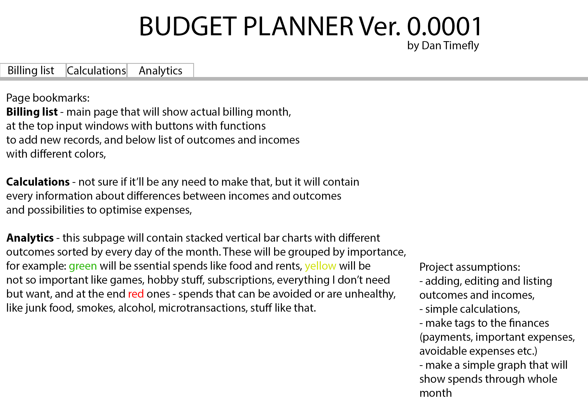
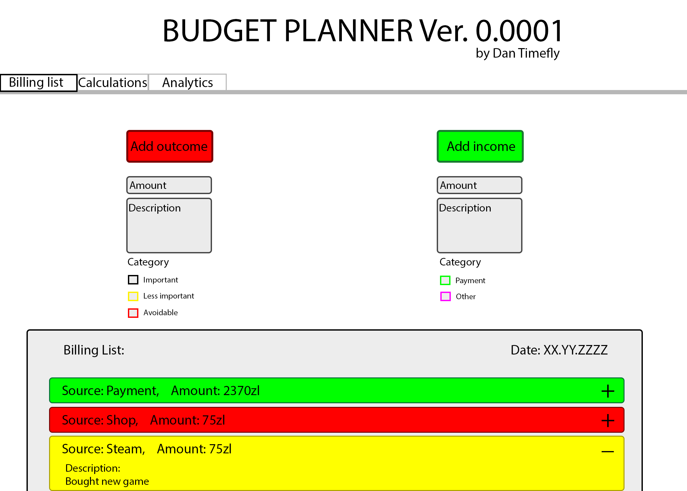

# Budget App

This project was generated with [Angular CLI](https://github.com/angular/angular-cli) version 8.2.1.

## Description

IN WORK

## Patch Notes

###Ver. 0.1:
Date: 26.05.2019
Description:
- created repo and make first note in README.md
- created empty template with nested components,
- added idea schemes with simple explanations,
- added some CSS (simple header with title, nav, main page),

## Project assumptions

IN WORK

## Scheme

Picture 1 - Idea of budget app:

Picture 2 - Billing List page:

